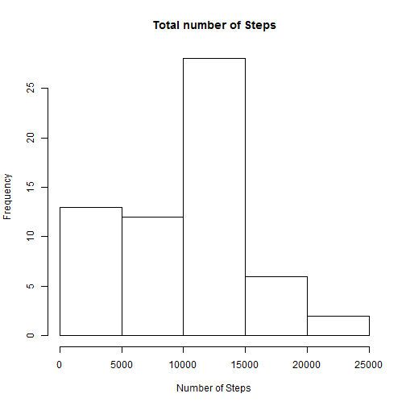
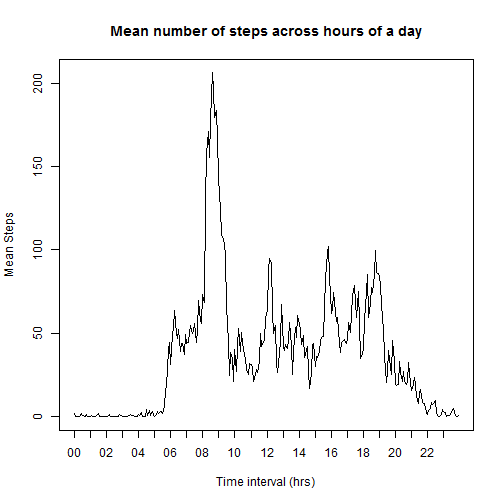
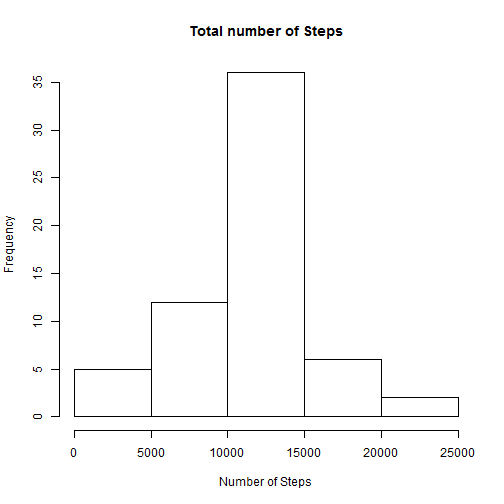
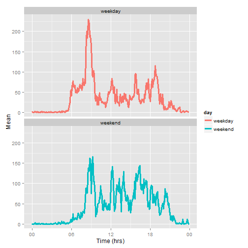

#Reproducible Analysis of Personal Movements Data

## Load the data (i.e. read.csv())

```r
setwd("D:/acad/coursera/Reproducible_Research/assn/RepData_PeerAssessment1")
d1 <- read.csv("activity.csv")
```
## Process the data to suit your format


##Question 1.1: Make a histogram of the total number of steps taken each day

Use 'dplyr' package for making the calculations, base plot system for the Histogram


```r
#detach(package:plyr) 
library(dplyr)
library(lubridate)
d1$date <- ymd(d1$date)
d2 <- group_by(d1,date) %>% summarise(Sum = sum(steps, na.rm=TRUE), Mean = mean(steps, na.rm=TRUE))
d2[is.na(d2$Mean), ]$Mean <- 0
hist(d2$Sum, xlab="", main="")
title(main="Total number of Steps", xlab="Number of Steps")
```

 

## Question 1.2: Calculate and report the mean and median total number of steps taken per day
 

1. Mean Steps per day, mean(d2$Sum, na.rm=TRUE):  9354.2295082  
2. Median Steps per day, median(d2$Sum, na.rm=TRUE) : 10395  

#Average Daily Activity Pattern
## Question 2.1: Time series plot (i.e. type = "l") of the 5-minute interval (x-axis) and the average number of steps taken, averaged across all days (y-axis)


```r
d2 <- d1
d2$interval <- as.POSIXct(sprintf("%04d",d2$interval), format="%H%M")
d4 <- group_by(d2,interval)
d6 <- summarize(d4, Sum = sum(steps, na.rm=TRUE),Mean = mean(steps, na.rm=TRUE))
plot(d6$interval, d6$Mean, type="l", main="",xlab="",ylab="Mean Steps", xaxt="n")
title(main="Mean number of steps across hours of a day", xlab="Time interval (hrs)")
axis.POSIXct(side=1, at=window(d6$interval,deltat=12), format="%H")
```

 

##Question 2.2: Which 5-minute interval, on average across all the days in the dataset, contains the maximum number of steps?


Interval with maximum steps is: 08:30, 08:35

#Imputing missing values

##Question 3.1: Calculate and report the total number of missing values in the dataset (i.e. the total number of rows with NAs)

Number of Records with missing Values in the field "Steps is" sum(is.na(d1$steps)): 2304 

##Question 3.2: Devise a strategy for filling in all of the missing values in the dataset. The strategy does not need to be sophisticated. For example, you could use the mean/median for that day, or the mean for that 5-minute interval, etc.

Here I am replacing the missing values by the 'Mean' number of steps for that particular time interval averaged over all days.


```r
missing_values <- which(is.na(d1$steps))
fill_d1 <- d1
fill_d1$interval <- as.POSIXct(sprintf("%04d",fill_d1$interval), format="%H%M")

for (i in missing_values) {fill_d1$steps[i] <- d6[d6$interval==fill_d1$interval[i],]$Mean }
```
##Question 3.3: Create a new dataset that is equal to the original dataset but with the missing data filled in

The Data Frame 'fill_d1' is the required data set with missing data filled in

##Question 3.4: Make a histogram of the total number of steps taken each day and Calculate and report the mean and median total number of steps taken per day.


```r
d7 <- group_by(fill_d1, date)
d8 <- summarize(d7,sum(steps),mean(steps))
names(d8) <- c("Date", "Sum", "Mean")
hist(d8$Sum, xlab="", main="")
title(main="Total number of Steps", xlab="Number of Steps")
```

 

1. Mean Steps per Day, mean(d8$Sum): 1.0766189 &times; 10<sup>4</sup>
2. Median Steps per Day, median(d8$Sum): 1.0766189 &times; 10<sup>4</sup>

The numbers have slightly changed.

#Are there differences in activity patterns between weekdays and weekends?

##Question 4.1: Create a new factor variable in the dataset with two levels -- "weekday" and "weekend" indicating whether a given date is a weekday or weekend day.


```r
mut_d1 <- mutate(fill_d1,day="weekday", value=weekdays(date))
mut_d1[mut_d1$value == "Saturday",]$day <- "weekend"
mut_d1[mut_d1$value == "Sunday",]$day <- "weekend"
d9 <- group_by(mut_d1,day,interval, add=TRUE)
d10 <- summarize(d9,sum(steps),mean(steps))
names(d10) <- c("day","interval","Sum","Mean")
```

## Question 4.2: Make a panel plot containing a time series plot (i.e. type = "l") of the 5-minute interval (x-axis) and the average number of steps taken, averaged across all weekday days or weekend days (y-axis). 

Using GGPLOT to make the desired plot


```r
library(ggplot2)
```

```
## Warning: package 'ggplot2' was built under R version 3.1.3
```

```r
library(scales)
```

```
## Warning: package 'scales' was built under R version 3.1.3
```

```r
g <- ggplot(d10, aes(x=interval,y=Mean, col=day)) + geom_line(size=1.2) + facet_wrap(~day, ncol=1)
g + xlab("Time (hrs)") + scale_x_datetime(labels=date_format("%H"))
```

 
